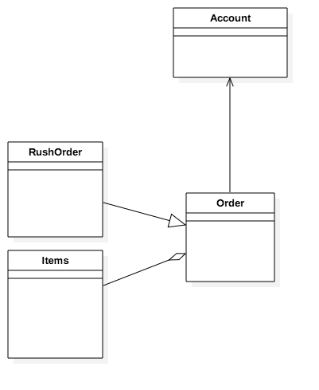
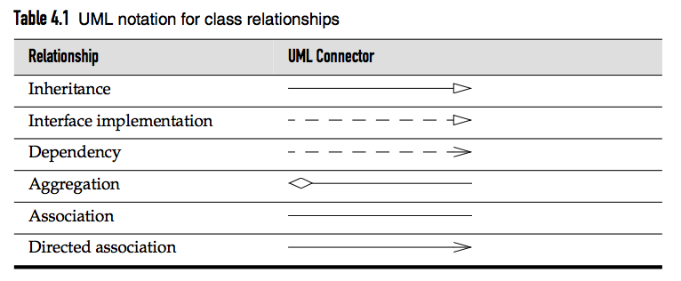

<h1 align="center">Objects and class</h1>
---
*In this chapter*

- 4.1 [Introduction to Object-Oriented Programming](#4.1.1-Classes)
- 4.2 [Using Predefined Classes](#pre-def-class)
- 4.3 Definening Your Own Classes
- 4.4 Static Fields and Methods
- 4.5 Method Parameters
- 4.6 Object Construction
- 4.7 Packages
- 4.8 The Class Path
- 4.9 Documentation Comments
- 4.10 Class Design Hints

---

##4.1 Introduction to Object-Oriented Programming

### <a name="4.1.1-Classes">4.1.1 Classes</a>

<h4>Some Definition: </h4> 

- **class**: blueprint
- **instance** : **construct** an object from a class 

Key concept in working : **Encapsulation**(information hiding): **data+behavior** in on package and *hiding* the implementation details.

- **instance fields**: The bits of data in an object
- **method** : the procedures that operate on the data.
- **current state** : a specific instance with the data specific in instance fields.

**Never directly access instance fields** in a class other than their own.

- Object : Classes being built by extending other classes.
- **inheritance** : built class by extending, adding methods and instance fields of our own. 

### 4.1.2 Objects

Three Key Characteristics of objects:

- **Behavior**
- **State**
- **Identity**

### 4.1.3 Identifying Classes

Different from the procedural program, the OOP often begins with identify your classes and then add methods to each class. Likes nouns and verbes.

### 4.1.4 Relationships between Classes

- **Dependence**: A use-a B
- **Aggregation**: A has a B
- **Inheritance**: A is a B

---

#### Dependence 

The dependence is the most common relationship between classes. For example order uses Account for checking credit status.

**Minimise coupling** : Our goal is sometimes minimise the dependences between classes, so that any change to B will not influence A. 

---

#### Aggregation 

Containment means that objects of class A contain objects of classB, for example, Order contains Items.

---

#### Inheritance

The is the relationship between a more special and a more general class. For example a *RushOrder* class inherits from an *Order* class.

## <a name ="pre-def-class">4.2 Use Predefined Class</a>

### 4.2.1 Objects and Object Variables

- Constructor : to construct new instances 
- Apply a method to object
- Object variable 
- inferto no object

~~~java
new Date();
String s =new Date().toString();
Date deadline; //Object Variable
deadline = null;

~~~

### 4.2.2 The LocalDate Class of the Java Library

On using Date, the time is represented by the number of milliseconds from a fixed point : **<mark>epoch</mark> 00:00:00 UTC, January 1, 1970** 

- UTC: Coordinated Universal Time
- GMT: Greenwich Mean Time.

**Factory Methods** : LocalDate.now() constructs a new object that represents the date at which the object was constructed. 

The LocalDate Class encapsulated instance fields to maintain the date to which it is set.

~~~java 
LocalDate.now();
LocalDate.of(1999,12,31);
LocalDate newYearsEve = LocalDate.of(1999, 12, 31);
int year = newYearsEve.getYear(); // 1999
int month = newYearsEve.getMonthValue(); // 12 
int day = newYearsEve.getDayOfMonth(); // 31

LocalDate aThousandDaysLater = newYearsEve.plusDays(1000); //1000 days after

year = aThousandDaysLater.getYear(); // 2002
month = aThousandDaysLater.getMonthValue(); // 09
day = aThousandDaysLater.getDayOfMonth(); // 26
~~~

### 4.2.3 Mutator and Accessor Methods

~~~java
LocalDate aThousandDaysLater = newYearsEve.plusDays(1000);
~~~

The original object remains unchanged. We say that the plusDays method **does not mutate the object** on which it is invoked. 

~~~java
GregorianCalendar someDay = new GregorianCalendar(1999, 11, 31); // Odd feature of that class: month numbers go from 0 to 11
someDay.add(Calendar.DAY_OF_MONTH, 1000);
~~~

The add() is a **mutator method**. 

---

- <mark>Mutator method</mark>: Access and Modified Object. 
- <mark>Accessor Method</mark>: Access without Modify. 